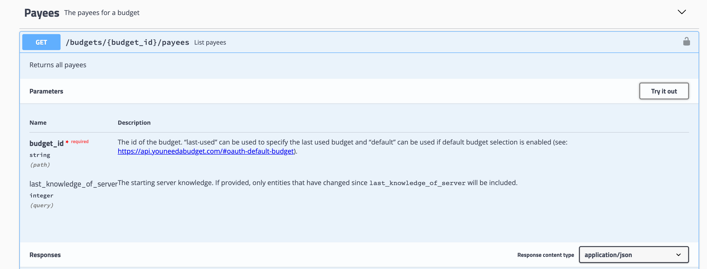
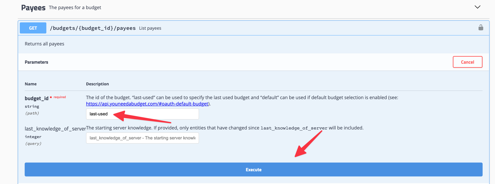
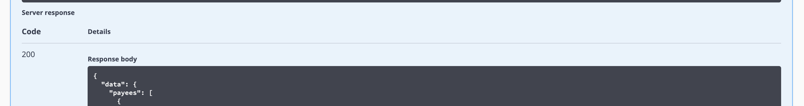

# Amazon YNAB Reconciler

## Getting Started

You need to have the following information:

- Amazon Account Email
- Amazon Account Password
- YNAB API Key (You can find how to get yours [here](https://api.youneedabudget.com/#personal-access-tokens))
- Payee name and ID to be used to patch the transactions on Amazon (see instructions below)

> 👉 You will also need Chrome or the Chromium webdriver installed.

Run the application with

```bash
python3 -m amazon_ynab --init
```

This will prompt you for the information. Data will be saved by default on the working directory under `.env/secrets.yml`. To change the location, and see other options, run

```bash
python3 -m amazon_ynab --help
```

To run the application after initialization, run

```bash
python3 -m amazon_ynab run
```

The options available for the run command are:

- `--headless`: Run the application in headless mode.
- `--days-back [INT]`: Scrape the last [INT] days of transactions.
- `--short-items`: Shorten names of items to fit in the YNAB table.
- `--words-per-item [INT]`: Shorten names of items to fit in the YNAB table.

## Screenshots


## To obtain the Payee ID and Name

1. On your YNAB budget, create a Payee for Amazon if you don't have one, or would like to use a new one.
2. Go to the [YNAB API](https://api.youneedabudget.com/v1) and click on **Authorize** on the top right of the page. Input your YNAB API key in the field provided and click on **Authorize**.
3. Scroll down to Payees, there should be a box `/budgets/{budget_id}/payees`. Select it, click on `Try it out`, input your Budget ID on `budget_id` (you can also use `last-used` insted of the ID), and click on `Execute`.
4. Scroll down to where it says `Response Body`. You should see a list of Payees. Look for the Amazon payee you want to use to save the reconciled transactions (overwriting the existing import payee for each transaction). Copy the ID and name and use them to initialize the application.





## Troubleshooting

Sometimes the application fails to reconcile the transactions. In most cases this will be because YNAB doesn't show the automatically imported transactions on the API without some manual intervention. To fix this, you can go to your YNAB budget and for each of your accounts click on `View` at the top like the image below:


## Credits

### Projects

This project is heavily inspired from the following project:


## Project Structure [](https://github.com/TezRomacH/python-package-template)

This project was generated with [`python-package-template`](https://github.com/TezRomacH/python-package-template)

```

```
